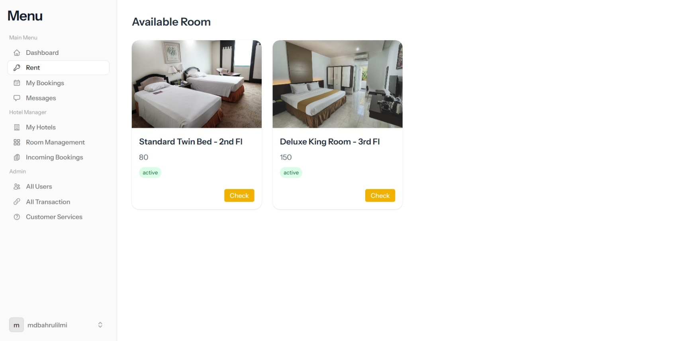

# Hotel Booking App - Backend

This is the backend of the **Hotel Booking Application**. It handles various features for managing hotel bookings, including creating and managing hotels, rooms, and booking transactions. The system supports different user roles such as **Guest**, **Owner**, and **Admin**, each with specific privileges.

## Features by Role

### 👤 Guest
- Browse and book available hotel rooms
- View booking list and details
- Send messages to hotel owners
- Access personalized dashboard

### 🏨 Owner
- Register and manage hotels
- Add, edit, and delete room listings
- View and manage room bookings
- Monitor guest activity related to their listings

### 🛠️ Admin
- Manage and edit user information (guests and owners)
- View all bookings across the platform
- Access transaction history
- Handle customer service and complaints

## Tech Stack
- **Backend:** Laravel
- **Frontend:** Blade + Tailwind CSS
- **Interactivity:** Livewire + Alpine.js
- **Database:** MySQL

## PREVIEW

